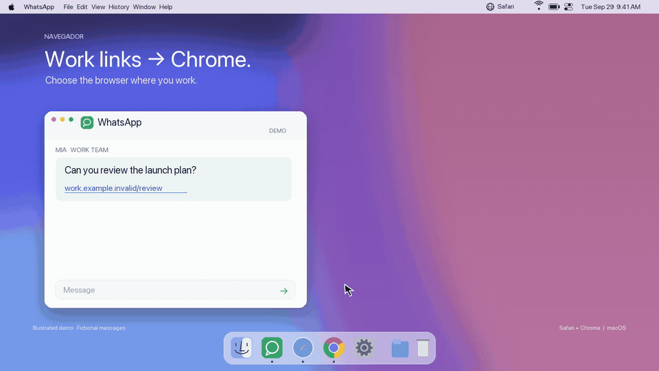

# Navegador 🌐



*15-second illustrated demo with fictional messages; not a screen recording.*

[](https://github.com/hectormonte1/navegador-menu/actions/workflows/ci.yml)

Switch between Safari and Google Chrome from the macOS menu bar.

**for people who use Safari for personal and Chrome for work**

Work link from WhatsApp? Choose Chrome. A friend sends something? Choose Safari. Select the browser before opening the link; existing tabs stay where they are.

[](https://github.com/hectormonte1/navegador-menu/releases/tag/v1.1.1)

[Apple Silicon download](https://github.com/hectormonte1/navegador-menu/releases/download/v1.1.1/Navegador-arm64.zip) · [Intel download](https://github.com/hectormonte1/navegador-menu/releases/download/v1.1.1/Navegador-x86_64.zip)

Requires macOS 13+. **Experimental downloads:** ad hoc signed, not Apple notarized. macOS may block opening them. If it does, use the local build instructions below; do not disable Gatekeeper.

A small portfolio project built around an everyday need, using native APIs and documenting the journey from prototype to a maintainable app.

## Features

- Displays the default browser and lets you choose Safari or Chrome.
- Checks HTTP and HTTPS separately; a partial checkmark means their associations differ.
- Respects macOS confirmation dialogs and cancellations.
- Offers optional launch at login, disabled by default for a new installation.
- Refreshes when you open the menu and every five seconds while it is closed.
- Runs without servers, accounts, analytics, or third-party dependencies.

The app interface and project documentation are in English. Native macOS dialogs and system-provided error details follow your system language.

## Requirements and build

macOS 13 or later. Building requires Xcode Command Line Tools with Swift 5.9 or later (Xcode 15+). Safari ships with macOS; Chrome must be installed to select it.

```bash
bash scripts/test.sh
bash build.sh
```

The output is `build/Navegador-arm64.zip` or `build/Navegador-x86_64.zip`, depending on the architecture. Architecture is detected automatically, or you can select it explicitly:

```bash
ARCH=arm64 bash build.sh    # Apple Silicon
ARCH=x86_64 bash build.sh   # Intel
```

Each build targets one architecture. Building does not install or launch the app, or change system preferences. The minimum macOS version is set explicitly in both the executable and the manifest to prevent accidental compatibility issues.

## Installation and usage

1. Download the ZIP for your Mac from [v1.1.1](https://github.com/hectormonte1/navegador-menu/releases/tag/v1.1.1), or build locally using the instructions above. Choose **Apple Silicon** for M-series Macs or **Intel** for Intel Macs (check **About This Mac**).
2. Extract the ZIP for your architecture, copy `Navegador.app` to Applications using Finder, and open it.
3. Click the globe, select a browser, and accept the macOS confirmation if prompted.
4. Optionally enable **Open at Login**. macOS may require approval in System Settings.

The downloadable ZIPs and local builds use an **ad hoc** signature and hardened runtime. They are not Developer ID signed or notarized. Ad hoc signing does not verify the publisher, and macOS may block a downloaded app. Building locally is the current alternative. Do not disable Gatekeeper or remove quarantine to install them; see [SECURITY](SECURITY.md). Release assets include `SHA256SUMS` for checking file integrity.

When upgrading from the prototype, disable its launch-at-login setting and quit it before opening this version. The app now uses a project-specific bundle identifier; running both versions can create duplicate menu items.

**Quit** closes the app without disabling launch at login. To uninstall, disable that option, quit, and move the app to Trash. Your selected default browser remains in place.

## Development and testing

| File | Responsibility |
| --- | --- |
| `Sources/main.swift` | Menu, messages, and launch at login |
| `Sources/BrowserService.swift` | Browser state and testable switching sequence |
| `Sources/WorkspaceBrowserSystem.swift` | macOS API integration |
| `Resources/Info.plist` | App identity and minimum system version |
| `Tests/BrowserServiceTests.swift` | Tests using a simulated system |

Tests do not change real preferences. They cover unknown state, partial and complete selection, missing browsers, unsupported identifiers, unnecessary changes, cancellation, partial failures, callbacks without applied changes, and concurrent requests. GitHub Actions runs the tests and builds both architectures; this does not replace visual testing on Intel and Apple Silicon hardware.

Optional local diagnostics (read-only; no preference changes):

```bash
/Applications/Navegador.app/Contents/MacOS/Navegador --diagnose
```

Adjust the path if you installed the app in your user Applications folder.

Before distribution, manually switch Safari → Chrome → Safari, check both protocols, cancel a confirmation, and verify that the menu reports the actual state. Test launch at login after saving your work. Existing browser tabs and apps that force their own browser are unaffected.

## Project history

Read the [case study](docs/CASE_STUDY.md), [technical decisions](docs/ARCHITECTURE.md), and [changelog](CHANGELOG.md). Git history starts with the version prepared for public release: earlier prototypes are documented, without inventing retroactive commits.

Created by [hectormonte1](https://github.com/hectormonte1), with assistance from Codex. See [CONTRIBUTING](CONTRIBUTING.md) to contribute.

## Reuse permissions

This repository is published as a portfolio project. An open-source license has not yet been selected; public visibility does not automatically grant general reuse permissions.
